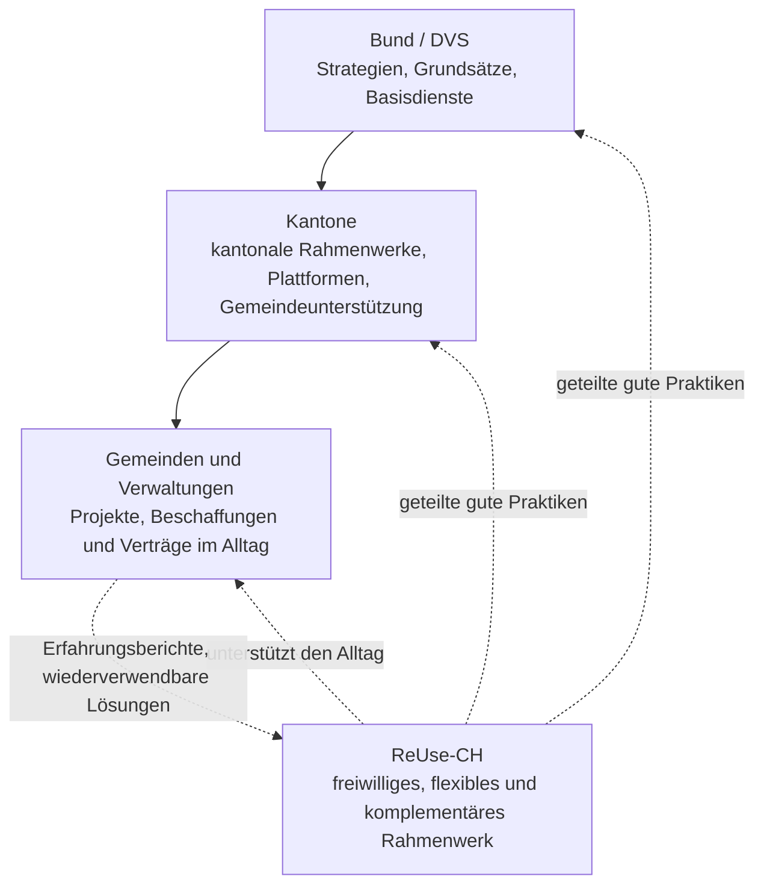

# ReUse-CH

> [Français](README.md) · **Deutsch**

> **Ein freiwilliges und flexibles Rahmenwerk für eine verantwortungsvolle, innovative und gemeinschaftlich getragene digitale Transformation der Schweizer Verwaltungen.**

> 🚧 **Rahmenwerk in Ko-Konstruktion.** Diese Version 0.1 ist eine offene Arbeitsgrundlage. Sie soll von interessierten Verwaltungen, Dienstleistern und Mitwirkenden diskutiert, ergänzt und weiterentwickelt werden. Ihre Rückmeldungen prägen die v1.0: siehe [Mitwirken](CONTRIBUTING.md).

> 🌐 *Diese Übersetzung basiert auf der Version 0.1.0 der **französischen Referenzfassung** (die im Zweifelsfall massgebend ist) und wurde mit KI-Unterstützung erstellt. Die Durchsicht durch Muttersprachler:innen ist ausdrücklich willkommen; Korrekturen gerne als Issue oder Pull Request, auch auf Deutsch.*

## Was ist ReUse-CH?

**ReUse-CH** ist ein **freiwilliges, operatives Rahmenwerk** für eine **verantwortungsvolle digitale Transformation** der Schweizer Verwaltungen. Es unterstützt jede Verwaltung, von der 500-Einwohner-Gemeinde bis zum Kanton, dabei, **verantwortungsvolle, wiederverwendbare, ressourcenschonende, sichere und nutzerzentrierte** digitale Entscheidungen zu treffen, unabhängig von Grösse, Mitteln und Kontext.

## Positionierung

Drei Merkmale definieren ReUse-CH:

- **Freiwillig**: Keine Verwaltung ist zur Anwendung verpflichtet. Das Rahmenwerk hat keine bindende Kraft und beansprucht keine. Seine Legitimität kommt aus seinem Nutzen, der sich in der Praxis erweisen muss.
- **Komplementär**: Es ersetzt weder die Strategie der Digitalen Verwaltung Schweiz (DVS) noch die kantonalen Rahmenwerke oder etablierten Referenzwerke (HERMES, COBIT, ITIL, ISO 27001, eCH-Standards). Es macht sie im Alltag anwendbar: dort, wo eine Verwaltung eine Software auswählt, einen Vertrag unterschreibt, ein Projekt startet. Die eidgenössischen und kantonalen Strategien sagen das Was und das Warum; ReUse-CH bietet das Wie, auf Augenhöhe jeder Verwaltung.
- **Flexibel und verhältnismässig**: Jede Verwaltung passt es ihrer Realität an: von einer einzelnen Checkliste bis zur Gesamteinführung, nach dem Grundsatz **just enough, just in time, just for the risk**.

## Die fünf Reflexe

1. **Zuerst wiederverwenden**: vor jedem Kauf oder jeder Eigenentwicklung das Bestehende prüfen (intern, bei anderen Gemeinwesen, Open Source).
2. **Messen, um zu verbessern**: wenige nützliche Kennzahlen verfolgen. Nicht versuchen, alles zu messen.
3. **Teilen, um zu sparen**: Code, Daten, Pflichtenhefte, Erfahrungsberichte.
4. **Für die Nutzenden gestalten**: Barrierefreiheit, Inklusion, Tests mit den Nutzenden.
5. **Standardmässig absichern**: Datenschutz und Cybersicherheit von der Konzeption an.

## So läuft es ab

Das Rahmenwerk wird in drei Schritten angewendet, im Rhythmus jeder Verwaltung:

1. **Standortbestimmung machen**: Praxis für Praxis erfassen, wo Sie stehen.
2. **Erste Massnahmen angehen**: Die Standortbestimmung zeigt, was in Ihrer Situation Priorität hat.
3. **In Stufen vorankommen**: Starten, dann Strukturieren, dann Gemeinsam nutzen und teilen, immer verhältnismässig zu Ihren Mitteln und Risiken. Der Fortschritt folgt dem Verbesserungszyklus [R-E-U-S-E](docs/04_cycle_reuse.md) *(aus dem Französischen: Responsabiliser – Évaluer – Unifier – Soutenir – Étendre: Verantwortung klären, Bewerten, Vereinheitlichen, Unterstützen, Ausweiten)*.

## Loslegen: Ihre Standortbestimmung in 20 Minuten

**[➜ Werkzeug für Standortbestimmung und Verlaufsverfolgung öffnen](https://reuse-ch.ch/)** *(français · deutsch)*

Das Werkzeug zeigt die Praktiken des Rahmenwerks, geordnet nach den fünf Achsen. Sie markieren jede als «zu tun», «in Arbeit», «erledigt» oder «nicht relevant», und die Übersicht zeigt Ihnen, wo Sie beginnen sollten. Alles läuft in Ihrem Browser: **keine Daten verlassen Ihren Arbeitsplatz**, kein Konto, kein Server. Ihr Stand wird in eine Datei exportiert, die Ihrer Verwaltung gehört; importieren Sie sie im Folgejahr, um die Entwicklung zu sehen.

Für eine punktuelle Reifegradbewertung mit Punktzahl pro Achse und Vergleich über die Zeit (im Workshop oder alle 12 bis 24 Monate) nutzen Sie die [Reifegrad-Diagnose](outils/diagnostic_maturite.md) *(FR)*.

## Weiterführend

[Das Rahmenwerk lesen](docs/README.md) *(FR)* · [Werkzeugkasten](docs/06_boite_a_outils.md) *(FR)* · [Beispiele](exemples/usecase_geocity.md) *(FR)* · [Roadmap](roadmap/outils.md) *(FR)* · [Mitwirken](CONTRIBUTING.md) · [LinkedIn-Community](https://www.linkedin.com/company/swiss-it-sustainability-community-of-practice/) · [Lizenz CC BY-SA 4.0](LICENSE.md)

**Besonders gesucht:** die Durchsicht dieser Übersetzung durch Muttersprachler:innen sowie Erfahrungsberichte aus Deutschschweizer Gemeinden und Kantonen.

---

> **ReUse-CH hilft jeder Verwaltung, die Digitalisierung als Gemeingut zu gestalten: nützlich für die Gesellschaft, wirtschaftlich beherrscht und ökologisch massvoll.**
