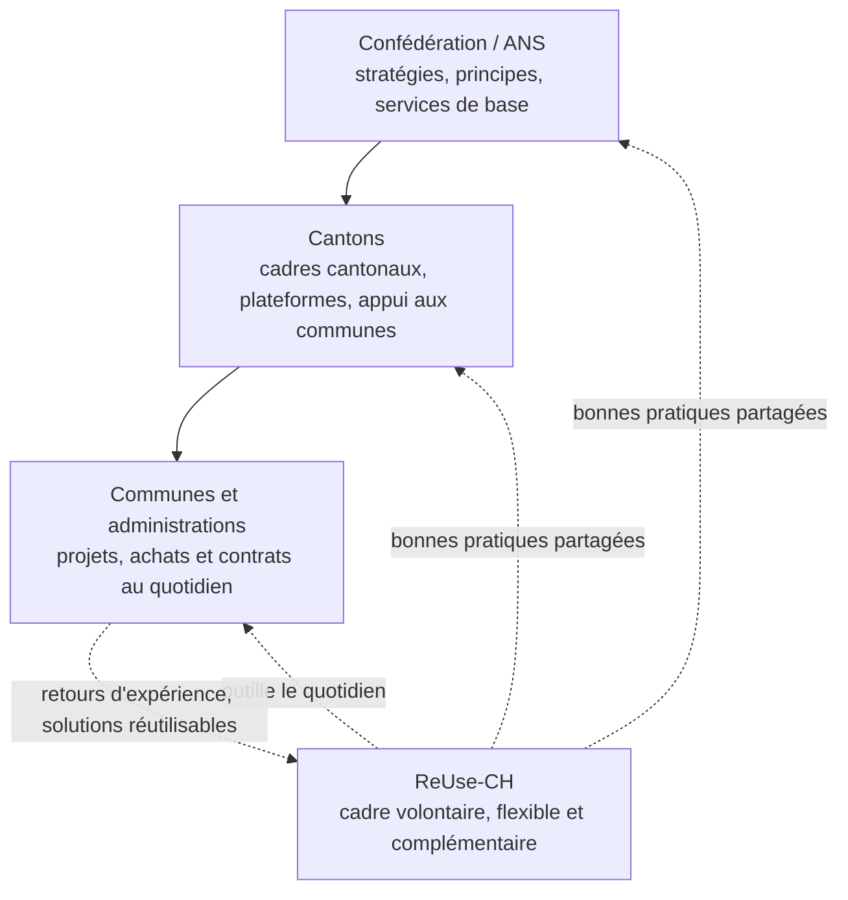

# ReUse-CH

> **Français** · [Deutsch](README.de.md)

> **Un cadre volontaire et flexible pour une transformation numérique Responsable, Innovante et Mutualisée des administrations publiques suisses.**

> 🚧 **Cadre en co-construction.** Cette version 0.1 est une base de travail ouverte, que les administrations, prestataires et contributeur·rice·s intéressés sont invités à discuter et à enrichir. Vos retours façonneront la v1.0 : voir [comment contribuer](CONTRIBUTING.md).

## Qu'est-ce que ReUse-CH ?

**ReUse-CH** est un cadre **volontaire et opérationnel** pour une **transformation numérique responsable** des administrations publiques suisses. Il aide chaque administration, de la commune de 500 habitants au canton, à faire des choix numériques **responsables, réutilisables, sobres, sécurisés et centrés sur l'usager**, quels que soient sa taille, ses moyens et son contexte.

## Positionnement

Trois caractéristiques définissent ReUse-CH :

- **Volontaire** : aucune administration n'est tenue de l'adopter. Le cadre n'a pas de force obligatoire et n'en revendique aucune. Sa légitimité vient de son utilité, qui doit être démontrée par l'usage.
- **Complémentaire** : il ne remplace ni la stratégie de l'Administration numérique suisse (ANS), ni les cadres cantonaux, ni les référentiels établis (HERMES, COBIT, ITIL, ISO 27001, standards eCH). Il les rend actionnables au quotidien, là où une administration choisit un logiciel, signe un contrat, lance un projet. Les stratégies fédérales et cantonales disent le quoi et le pourquoi ; ReUse-CH propose le comment, à hauteur de chaque administration.
- **Flexible et proportionné** : chaque administration l'adapte à sa réalité : on peut n'en prendre qu'une checklist ou déployer l'ensemble, selon le principe **just enough, just in time, just for the risk**.

## Les cinq réflexes

1. **Réutiliser avant tout** : vérifier l'existant (interne, autres collectivités, open source) avant d'acheter ou de développer.
2. **Mesurer pour améliorer** : suivre quelques indicateurs utiles. Ne pas chercher à tout mesurer.
3. **Partager pour économiser** : code, données, cahiers des charges, retours d'expérience.
4. **Concevoir pour l'utilisateur** : accessibilité, inclusion, tests avec les usagers.
5. **Sécuriser par défaut** : protection des données et cybersécurité dès la conception.

## Comment ça se déroule

Le cadre s'applique en trois temps, au rythme de chaque administration :

1. **Faire l'état des lieux** : identifier où vous en êtes, pratique par pratique.
2. **Engager les premières actions** : l'état des lieux vous montre quoi faire en priorité selon votre situation.
3. **Progresser par niveaux** : Démarrer, puis Structurer, puis Mutualiser et partager, toujours proportionnellement à vos moyens et à vos risques. La progression suit le cycle d'amélioration continue [R-E-U-S-E](docs/04_cycle_reuse.md) : Responsabiliser, Évaluer, Unifier, Soutenir, Étendre.

## Commencer : votre état des lieux en 20 minutes

**[➜ Ouvrir l'outil d'état des lieux et de suivi](https://reuse-ch.ch/)** *(français · deutsch)*

L'outil présente les pratiques du cadre organisées par les cinq axes. Vous marquez chacune « à faire », « en cours », « fait » ou « non pertinent », et la synthèse vous montre par où commencer. Tout fonctionne dans votre navigateur : **aucune donnée ne quitte votre poste**, pas de compte, pas de serveur. Votre suivi s'exporte dans un fichier qui appartient à votre administration ; réimportez-le l'année suivante pour visualiser la trajectoire.

Pour une évaluation de maturité ponctuelle, avec score par axe et comparaison dans le temps (en atelier, ou tous les 12 à 24 mois), utilisez plutôt le [diagnostic de maturité](outils/diagnostic_maturite.md).

## Pour aller plus loin

[Lire le cadre](docs/README.md) · [Boîte à outils](docs/06_boite_a_outils.md) · [Exemples](exemples/usecase_geocity.md) · [Feuille de route](roadmap/outils.md) · [Contribuer](CONTRIBUTING.md) · [Communauté LinkedIn](https://www.linkedin.com/company/swiss-it-sustainability-community-of-practice/) · [Licence CC BY-SA 4.0](LICENSE.md)

---

> **ReUse-CH aide chaque administration à faire du numérique un bien commun : utile pour la société, maîtrisé économiquement et sobre environnementalement.**
