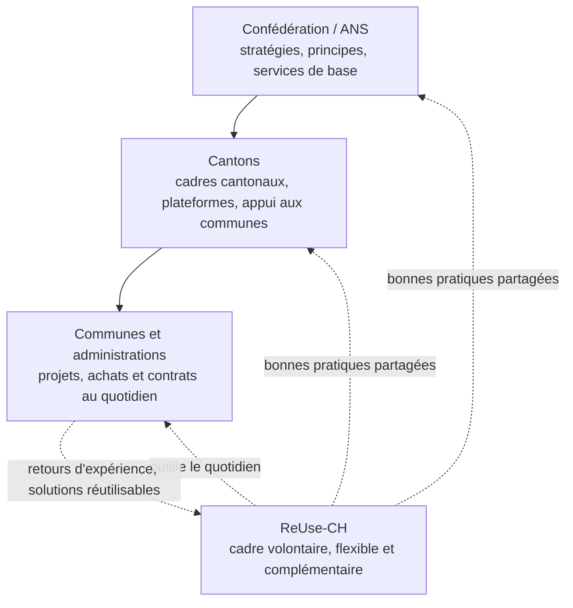

# Vue d'ensemble et positionnement

> Documentation du cadre **ReUse-CH** · [⬅ Retour à l'index](README.md)

## Vue d'ensemble

**ReUse-CH** est un cadre opérationnel destiné à soutenir la **transformation numérique responsable** des administrations publiques suisses.

Il s'inscrit en complément et en soutien de la **Stratégie Suisse numérique**, de l'**Administration numérique suisse (ANS)** ainsi que des **stratégies, architectures, standards et dispositifs propres aux cantons**.

Là où les cadres nationaux et cantonaux définissent les orientations, les priorités et les conditions-cadres, **ReUse-CH facilite leur mise en œuvre opérationnelle à l'échelle locale**, dans le respect du fédéralisme, de la subsidiarité et de l'autonomie communale.

**Objectif principal :** transformer la diversité administrative suisse en une **force collective**, en créant un **bien commun numérique** ouvert, sûr, sobre, interopérable et centré sur l'usager.

ReUse-CH n'a pas vocation à tout imposer, partout, immédiatement. Le cadre repose sur une approche **incrémentale, proportionnée et adaptée aux ressources disponibles** : chaque administration peut commencer par quelques améliorations utiles, puis progresser étape par étape selon sa maturité, ses risques, ses priorités et la criticité de ses prestations numériques.

ReUse-CH s'adresse aux administrations publiques suisses de toutes tailles :

- Confédération ;
- cantons ;
- communes ;
- associations intercommunales ;
- établissements publics ;
- partenaires parapublics.

Le cœur de cible est toutefois l'échelon communal et intercommunal. Les offices fédéraux et les cantons peuvent utiliser le cadre pour leurs propres projets, mais ils interviennent surtout comme couche amont (stratégies, standards, services de base) dont ReUse-CH facilite la mise en œuvre locale.

Les administrations partagent de nombreux besoins numériques similaires : prestations à la population, gestion administrative, cybersécurité, données, inclusion, coûts, durabilité, infrastructures et relations avec les fournisseurs. Elles ne disposent toutefois pas toutes des mêmes ressources, compétences, environnements techniques, partenaires, contraintes politiques ou constellations institutionnelles.

De nombreuses petites et moyennes administrations dépendent fortement de prestataires externes pour la mise en œuvre, la configuration, l'exploitation et l'évolution de leurs systèmes numériques. Cette dépendance crée un enjeu spécifique : les choix techniques, fonctionnels ou contractuels des fournisseurs influencent directement la qualité du service public, la sécurité, la protection des données, l'accessibilité, les coûts, l'interopérabilité, la sobriété et la capacité de réutilisation.

ReUse-CH vise donc aussi à mieux encadrer et accompagner les prestataires numériques, afin que leurs interventions soient alignées avec les responsabilités publiques des administrations et avec les principes de mutualisation, sobriété, sécurité, transparence et orientation usager.

C'est pourquoi ReUse-CH est conçu comme un cadre **modulable** :

- commun dans ses principes ;
- adaptable dans sa mise en œuvre ;
- compatible avec les cadres existants ;
- progressif selon la maturité de chaque organisation ;
- proportionné aux ressources, aux risques et aux impacts réels.

## Positionnement institutionnel

ReUse-CH est un cadre **volontaire** pour une **transformation numérique responsable** : aucune administration n'est tenue de l'adopter, et sa légitimité vient de son utilité, démontrée par l'usage. Il est **complémentaire** aux cadres fédéraux et cantonaux, et **assez flexible pour s'adapter à chaque administration, quelles que soient sa taille et son contexte**.

Il ne remplace donc ni la stratégie de l'Administration numérique suisse (ANS), ni les stratégies cantonales, ni les référentiels déjà utilisés par les administrations. Les stratégies fédérales et cantonales définissent le *quoi* et le *pourquoi* ; ReUse-CH propose le *comment*, à hauteur de chaque administration : là où se choisissent les logiciels, se signent les contrats et se lancent les projets.

Deux précisions découlent de ce positionnement :

- **Volontaire ne signifie pas facultatif en tout.** Plusieurs exigences reprises par le cadre relèvent d'obligations légales : protection des données (LPD), accessibilité des prestations publiques (LHand), droit des marchés publics (LMP/AIMP). Le cadre aide à s'y conformer, mais ne les rend pas optionnelles. Le surcroît proprement volontaire porte sur la réutilisation, le partage, la sobriété et la mutualisation.
- **Complémentaire vaut aussi pour les cantons.** Plusieurs cantons offrent déjà à leurs communes des plateformes, des contrats-cadres ou un appui au numérique : ReUse-CH encourage à utiliser ces dispositifs en priorité et vise à les renforcer, pas à les contourner.

Pour dissiper les malentendus les plus fréquents : ReUse-CH n'est ni une couche administrative supplémentaire, ni un instrument de centralisation contraire au principe de subsidiarité, ni un outil destiné à remplacer les prestataires ou à internaliser toutes les compétences numériques, ni un modèle *one size fits all*. Il vise au contraire à mieux cadrer la collaboration avec les prestataires, afin que leur expertise contribue aux responsabilités publiques des administrations.

Il agit comme une **boussole opérationnelle** permettant de relier les cadres existants et de les rendre cohérents dans les décisions numériques concrètes.

> **ReUse-CH n'ajoute pas une couche de complexité : il donne aux administrations publiques une grille commune, modulable et opérationnelle pour faire des choix numériques responsables, réutilisables, sobres et alignés avec les stratégies nationales, cantonales et locales.**

ReUse-CH peut compléter différents référentiels ou méthodes déjà utilisés, par exemple :

- **COBIT** pour la gouvernance IT ;
- **HERMES** pour la gestion de projet ;
- **ITIL** pour la gestion des services ;
- **ISO 27001** pour la sécurité de l'information ;
- **eCH** pour les standards suisses d'interopérabilité ;
- **WCAG / eCH-0059** pour l'accessibilité numérique ;
- **DCAT-AP-CH** pour les catalogues de données ;
- **LPD** pour la protection des données ;
- **FinOps / Green IT** pour la maîtrise économique et environnementale du numérique.

## Articulation avec les cadres existants

ReUse-CH ne remplace pas les instruments existants. Il les relie et les rend cohérents autour d'une culture commune du numérique responsable.

| Cadre ou méthode | Apport principal | Contribution de ReUse-CH |
|------------------|------------------|---------------------------|
| Stratégie Suisse numérique | Vision nationale | Mise en œuvre opérationnelle locale |
| Administration numérique suisse | Coordination fédérale | Déclinaison communale et intercommunale |
| Stratégies cantonales | Priorités et dispositifs cantonaux | Adaptation aux réalités locales |
| COBIT | Gouvernance IT | Orientation responsable, publique et mutualisée |
| HERMES | Gestion de projet | Critères ReUse dans les phases projet |
| ITIL | Gestion des services | Sobriété, expérience usager, amélioration continue |
| ISO 27001 | Sécurité de l'information | Sécurité intégrée aux choix numériques |
| eCH | Standards suisses | Interopérabilité et mutualisation |
| WCAG / eCH-0059 | Accessibilité | Inclusion numérique |
| DCAT-AP-CH | Catalogues de données | Publication et réutilisation des données |
| LPD | Protection des données | Privacy by design |
| FinOps | Maîtrise des coûts cloud | Optimisation économique |
| Green IT | Sobriété numérique | Réduction de l'impact environnemental |
| Marchés publics | Acquisition de biens et services | Exigences responsables, cycle de vie, réversibilité |
| Contrats fournisseurs | Relation avec les prestataires | Responsabilités, documentation, sécurité, portabilité |
| LMETA (EMBAG) | Open source et open data au niveau fédéral | Extension volontaire des mêmes principes aux cantons et communes |
| Services de base nationaux (AGOV, e-ID, I14Y, opendata.swiss) | Briques réutilisables | Réutilisation avant tout développement |
| eOperations Suisse | Acquisition et exploitation en commun | Véhicule concret du niveau « Mutualiser » |
| ISIT-CH (charte, label, formations Numérique Responsable) | Sensibilisation, certification, mesure d'empreinte | ReUse-CH renvoie à ces instruments pour le volet NR plutôt que de les dupliquer |

## Pourquoi ReUse-CH ?

ReUse-CH vise à **simplifier, unifier et maîtriser** la transformation numérique publique. Il répond à cinq enjeux clés.

### Assumer la responsabilité numérique

- Respecter le cadre légal et éthique suisse.
- Protéger les droits fondamentaux, la vie privée et la sécurité des données.
- Garantir la transparence des usages numériques.
- Réduire l'empreinte écologique du numérique.
- Assurer la proportionnalité des solutions numériques déployées.

### Réduire les coûts et éviter la redondance

- Promouvoir la mutualisation et la réutilisation systématique des solutions, données, contrats, standards et retours d'expérience existants.
- Renforcer la coopération interadministrative.
- Appliquer les principes **reuse-first** et **copy with pride**.
- Limiter les achats isolés et les développements redondants.
- Maîtriser les coûts complets : acquisition, exploitation, maintenance, support, sécurité, formation et sortie.

### Accélérer l'innovation publique

- Offrir un socle commun de standards, plateformes, catalogues et bonnes pratiques.
- Libérer du temps et des ressources pour les projets à forte valeur ajoutée.
- Favoriser l'expérimentation responsable et l'innovation ouverte.
- Encourager la coopération entre administrations.
- Transformer les expériences locales en ressources réutilisables.

### Renforcer la confiance citoyenne

- Garantir la transparence sur les données, les algorithmes, l'empreinte CO₂ et la qualité de l'expérience utilisateur.
- Améliorer la lisibilité des choix numériques publics.
- Promouvoir l'accessibilité, l'inclusion et la participation.
- Documenter les décisions numériques importantes.

### Encadrer et accompagner les prestataires numériques

- Clarifier les attentes envers les fournisseurs qui conçoivent, configurent, exploitent ou maintiennent des systèmes publics.
- Réduire la dépendance excessive à certains prestataires ou solutions.
- Garantir que les choix techniques respectent les responsabilités publiques de l'administration.
- Exiger la documentation, la réversibilité, l'interopérabilité, l'accessibilité, la sécurité et la portabilité des données.
- Faciliter la mutualisation des solutions et des bonnes pratiques entre administrations utilisant les mêmes fournisseurs.
- Transformer la relation fournisseur en partenariat responsable, transparent et orienté valeur publique.

---

*ReUse-CH – Cadre volontaire pour une transformation numérique Responsable, Innovante et Mutualisée – Licence [CC BY-SA 4.0](../LICENSE.md)*
